# Holistic Healing and Crystals
## Introduction
Holistic Crystals and Healing is a site which explores some of the different kinds of crystals and Reiki healing. This site is targeted to individuals who want to explore and learn more about their inner beings and connect to their spiritual awakenings. I have created this site for people who are just beggining their spiritual journey, to find out a little bit about healing and what benifits crystals can have on the body and mind.

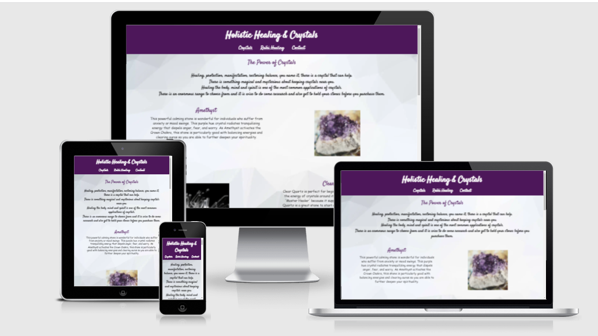

[Link to live site](https://charleyjo.github.io/portfolio-project-one/)

## User Experience (UX)
* User stories
* Visitor Goals
    * When visiting this site, I want to be able to navigate easily, to find any content I may wish to explore.

    * When visiting this site, I want to be able to easily find information about types of crystals and their properties.

    * When visiting this site, I want to be able to find out information about Reiki healing and what its used for.

    * When visiting this site, I want the to be able to send of my details so i can be contacted regarding classes in my area.

# Structure
The site consists of three main pages, Crystals, Reiki Healing and Contact. The contact page does not submit any information into a data base as it is just for project purposes.

# Design
The design of this site changed some what over the course of production, this was due to issues that I faced with image property size and some other minor issues, although the further I got into the design I then realised that I didn't need to change so much, as I could have easily rectified this with the correct aspect ratios and converting the images from .png to .WebP files.
The site consists of a main Crystals page, this page gives a breif descriptipn and image of four of the most popular crystals; Amethyst, Citrine, Clear Quartz and Rose Quartz. This page has a section with information on how to correctly choose crystals that suit you, then is finished off with an insperational quote in the footer relating to the subject. The second page is all about Reiki Healing and explains what it is, it also gives a breif history of the subject. Lastly there is a page with a form to insert the users personal information for the purpose of getting more information about Reiki classes in their area.

## Google Fonts
Google fonts were used to import the "Satisfy" and “cursive" font into the style.css file which is used on all pages throughout the project. 
## Font Awesome
Font Awesome was used on all pages throughout the website to add icons for social media links in the footer.

Heading 
* The main heading is used through out the site, I used the "Satisfy" font as this caught my eye as a very spiritual style font, and I used a purple and white color scheme, contrast was low so I changed to a darker background color and a lighter font color. 

Navigation
* The navigation menu features on all pages of the site. The position and style is consistent thought the three pages. A cursor pointer is implemented so when the user hovers over the desired page, the user can see that this is a clickable nav. The font used was the same as the heading keeping it consistent with the theme of the site.

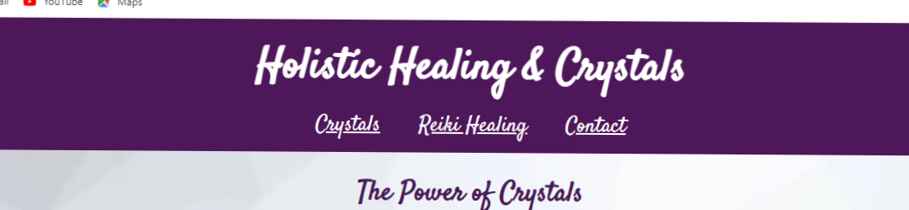

Footer
* The Footer has social media links including Instagram, Wikipidia and YouTube, they are consistent on all pages. I added the social media links for extra resources for the user to learn more regarding crystals and healing, all the links take the user to reiki or crystal inspired pages. In the footer for the Crystal and Reiki Healing pages I have included inspirational quotes that I think fit the subjects perfectly.

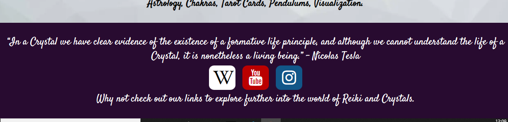

## Holistic Healing and Crystals Main Page

### Crystals

* The main page of the site has a subtle background image which I use across all of the three pages keeping it familiar to the user. The page consists of two paragraphs of text, the first gives a brief insight into the power of crystals.

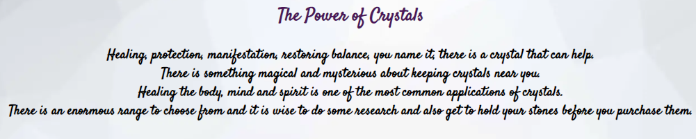

 * The second paragraph is to help the user know where to start when choosing their own crystals.

 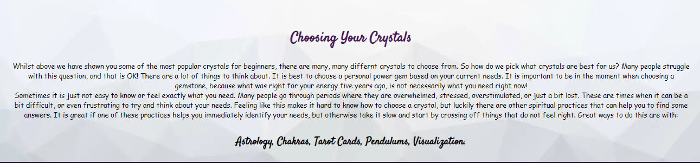

*  In between these paragraphs is a grid containing four of the most common crystals used by begginers and an image and a brief description of the crystals properties.

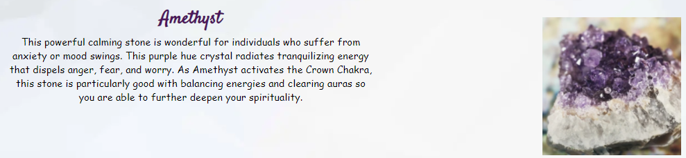

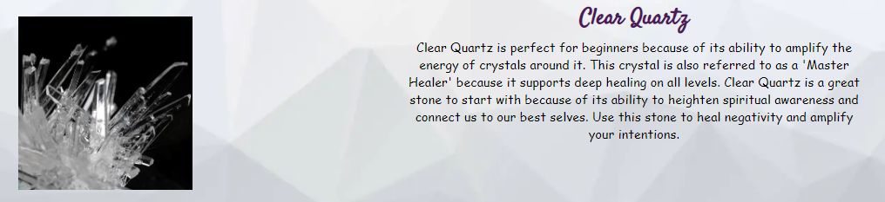

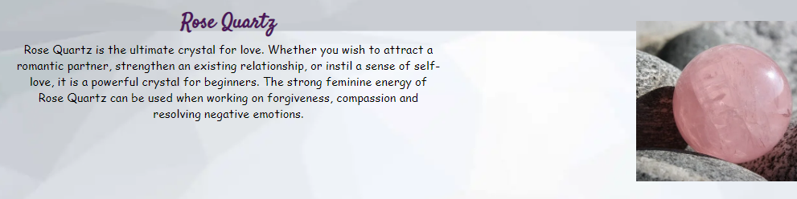

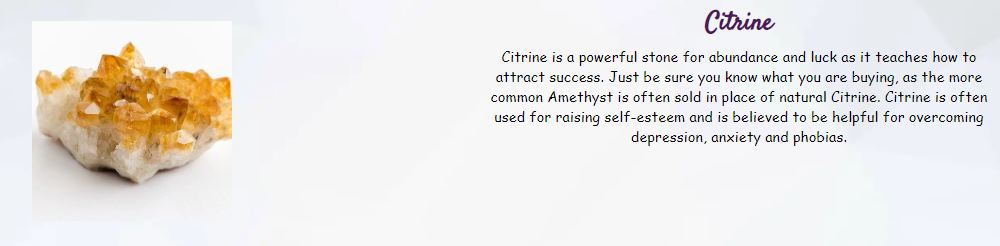

## Holistic Healing and Crystals Second Page

### Reiki Healing

* This page also consists of two paragraphs, the first giving the user information about what the Reiki Healing method is.

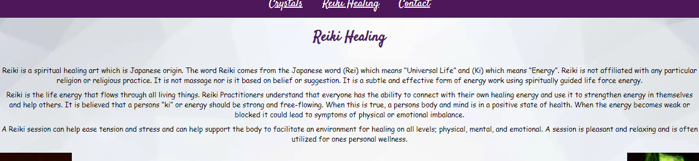

* The second paragraph is a brief background history of Reiki with two spiritual healing body images either side.

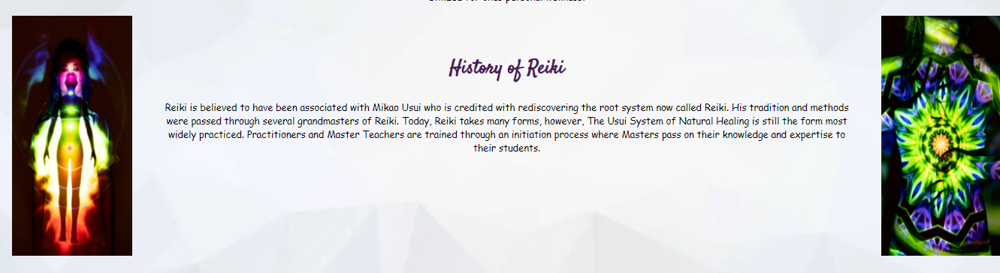

## Holistic Healing and Crystals Third Page

### Contact

* The contact page is made up of a short paragraph explaining that there are various Reiki classes across the UK that the user can attend if they enter in some personal information that requests more details, and a form for the user to input this.

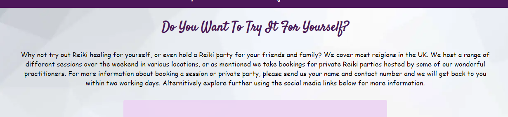

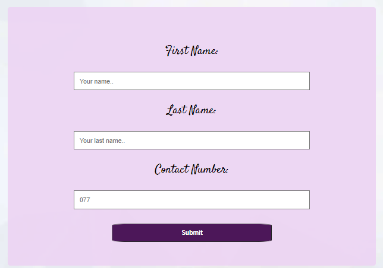

## Technologies Used

* HTML5
* CSS3

Photos source
 * https://www.vecteezy.com/
 * https://www.istockphoto.com/
 * https://www.pexels.com/

  To save on file space I ran all photos through https://tinypng.com/ and 
  https://image.online-convert.com

  ## Git
Git was used for version control by utilizing the Gitpod terminal, to commit to Git and Push to GitHub.
## VSCODE:
VSCODE is used to store the projects code after being pushed from Git.

## Testing
The W3C Markup Validator and W3C CSS Validator Services were used to validate every page of the project to ensure there were no syntax errors in the project.

### Google Chrome Lighthouse Report
* light house report contact page

* light house report healing page

 * light house report crystal page

